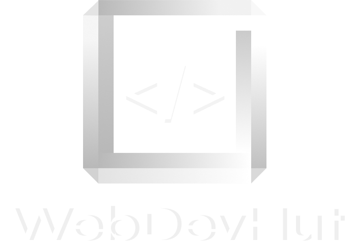

<p align="center">
  
</p>

<p align="center">

   [](https://github.com/adanj27/Web-Dev-Hut-Open-Source/blob/main/LICENSE)

</p>

<p align="center">
  
</p>

#### WebDevHut es una web para aprender desarrollo web frontend y backend donde encontraras información sobre las tecnologías y herramientas necesarias que se usan en desarrollo web en general. Este es un proyecto de Open Source desarrollado conjuntamente por un grupo de gente que le encanta desarrollo web.

- Si estas interesado en ser parte del proyecto por favor únete a nuestro canal de discord.

- [Discord](https://discord.gg/Hmew77TY).

## ⏳ Instalación

- (Usa npm para instalar las dependencias del proyecto.)

```bash
npm install
```

- (Usa npm para iniciar el proyecto.)

```bash
npm run dev
```

## 🔗 Enlaces

- [Discord](https://discord.gg/Hmew77TY).
- [Diseño Figma](https://www.figma.com/file/CVUWo2Up36fZrrC21cRi2J/Dise%C3%B1o-mockups?type=design&node-id=62%3A2&t=VS53gq55k94o10Bw-1).
- [Tareas del Proyecto](https://github.com/users/adanj27/projects/6/views/1)

- Nota: Seguir el diseño hecho en figma.

## 🚀 Contribución

¡Gracias por tu interés en contribuir a nuestro proyecto! Aquí te mostramos cómo puedes hacerlo.

- Lee las directrices de contribución antes de enviar cualquier cambio.
- Sé respetuoso con otros contribuidores y usuarios del proyecto.
- Contribuye con código de alta calidad que cumpla con las convenciones de estilo del proyecto.
- Comunícate de manera clara y efectiva con el equipo del proyecto.
- Haz cambios pequeños y realiza pruebas antes de enviar cambios.
- Respeta las decisiones del equipo del proyecto si su contribución es rechazada.

### 🌀 Clonar y forkear el repositorio

- Primero, clona el repositorio en tu máquina local usando el siguiente comando en tu terminal:

```bash
git clone https://github.com/adanj27/Web-Dev-Hut-Open-Source.git
```

Si aún no lo has hecho, forkea el repositorio en tu cuenta de GitHub para tener tu propia copia del proyecto.

### 🔍 Revisar la ruta del proyecto

- Antes de comenzar a trabajar en una nueva función o corrección, es importante revisar la ruta del proyecto para asegurarte de estar trabajando en la rama correcta y el archivo correcto.

### 📝 Elegir una tarea

- El siguiente paso es elegir una tarea para trabajar en ella. Puedes encontrar tareas en la sección de [projects](https://github.com/users/adanj27/projects/6/views/1) en el repositorio. Elige una y copia el enlace y pide a algún administrador que te asigne la tarea dandole tu nombre de usuario de github y el enlace de la tarea.

### 📂 Crear una rama

- Crea una nueva rama desde la rama principal (main o master) utilizando un nombre descriptivo que indique el problema que estás solucionando. Por ejemplo:

```bash
git checkout -b mi-nueva-funcion
```

### 💻 Realizar cambios y hacer commit

- Haz los cambios necesarios en la rama que creaste y crea un commit utilizando la convención de commit convencional para asegurarte de que se entienda claramente lo que estás haciendo. Los prefijos comunes son `feat`, `fix`, `doc`, `style`, `refactor`, `test` y `chore`.

```bash
git commit -m "feat: agregar nueva función de búsqueda"
```

### 📤 Hacer push a tu rama

- Haz push de tu rama a tu repositorio forkeado en GitHub.

```bash
git push origin mi-nueva-funcion
```

### 🤝 Enviar un Pull Request

- Ejecutar eslint antes de enviar o subir tu rama ejecuta:

```bash
npm run lint:fix
```

- Si tienes conflictos en la revisión de `lint` y `build` elimina tu Pull Request, revisa tu código, vuelve a ejecutar `npm run lint:fix` actualiza tu rama y envia una Pull Request a la rama master.

- Envía un Pull Request a la rama `develop` del repositorio original con tu nueva rama. Asegúrate de proporcionar una descripción clara y detallada de los cambios que has realizado y por qué son importantes.

### 🕵️‍♂️ Esperar la revisión y aprobación

- El equipo del proyecto revisará y discutirá tus cambios. Es posible que necesiten que realices algunos ajustes antes de que se puedan fusionar tus cambios en la rama principal.

🎉 ¡Gracias por tu contribución al proyecto!

## 📜 Licencia

Copyright © 2023 WebDevHut

## MIT

- Vea el archivo [LICENCE](./LICENCE) para mas información de la licencia.
